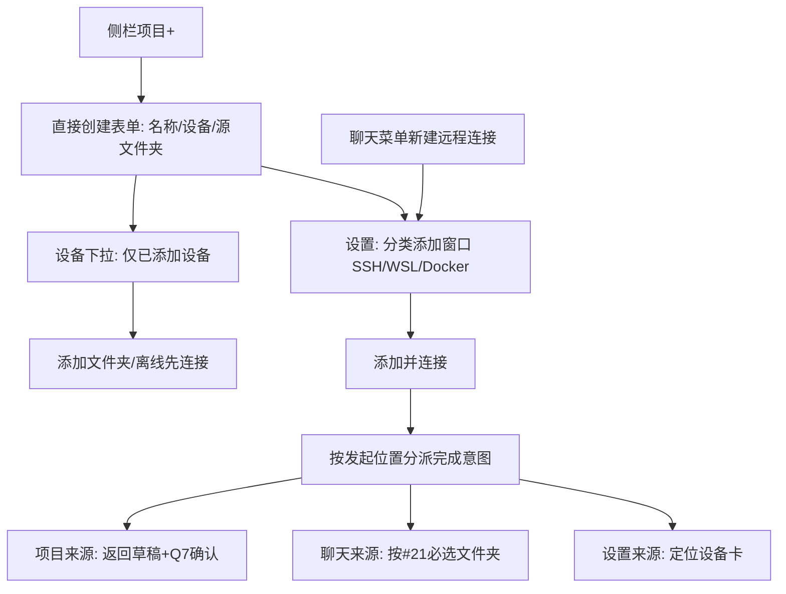

# Shared design view — rdux15 (Mermaid fallback; Archify 未运行，如实记录)

```mermaid
flowchart TD
    A[侧栏项目+] --> F[直接创建表单: 名称/设备/源文件夹]
    F --> S[设备下拉: 仅已添加设备] --> D[添加文件夹/离线先连接]
    F --> M[设置: 分类添加窗口 SSH/WSL/Docker] --> R[添加并连接]
    H[聊天菜单新建远程连接] --> M
    R --> O[按发起位置分派完成意图]
    O --> P1[项目来源: 返回草稿+Q7确认]
    O --> P2[聊天来源: 按#21必选文件夹]
    O --> P3[设置来源: 定位设备卡]
```
